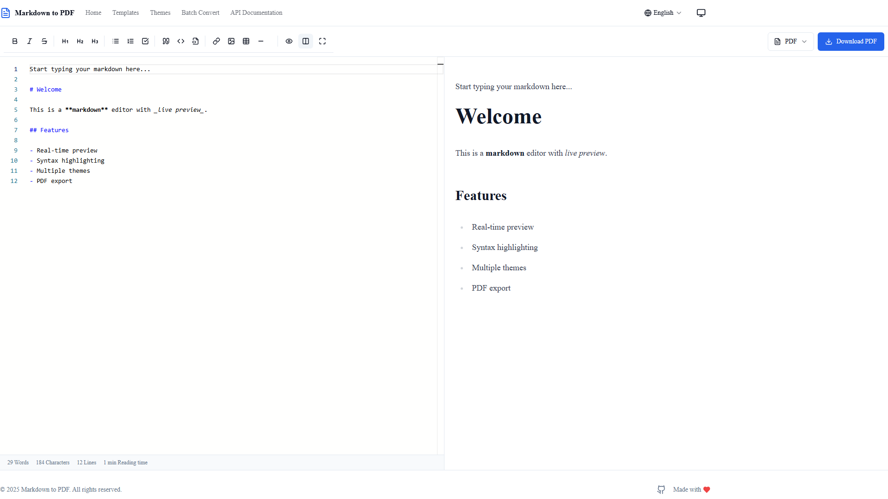
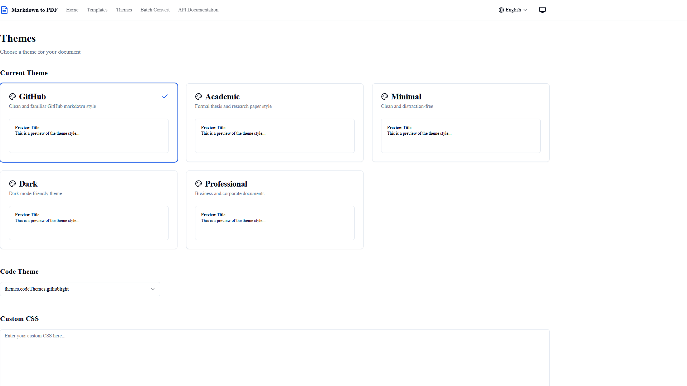
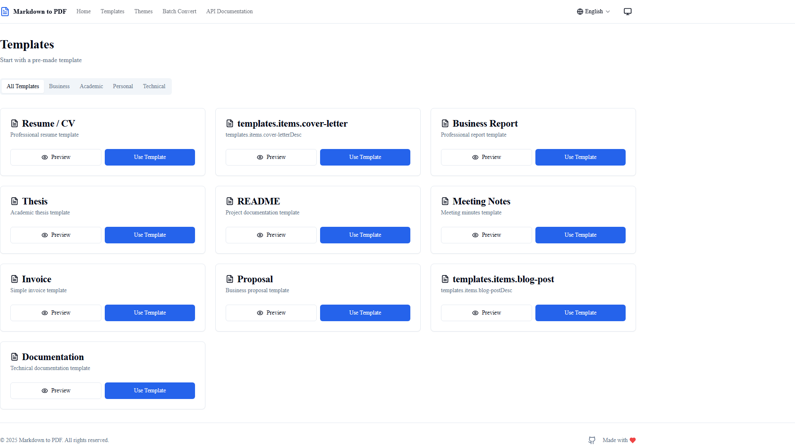
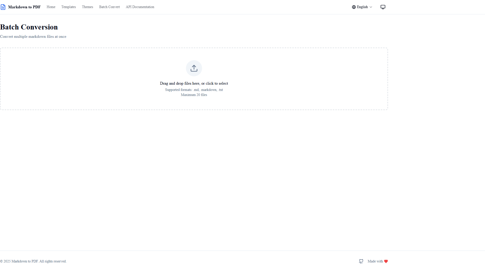
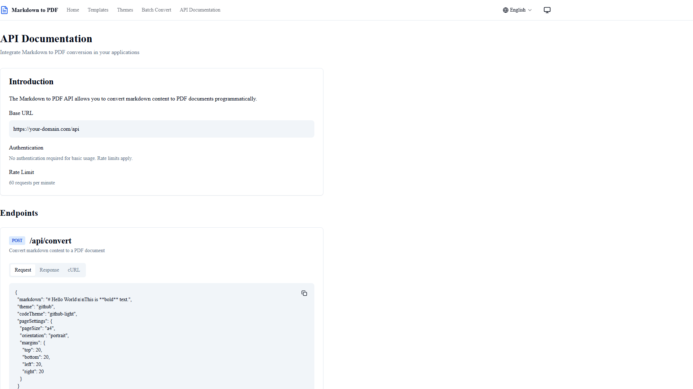
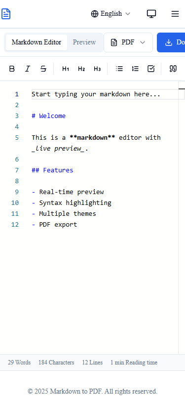

# Markdown to PDF Converter

A production-ready Markdown to PDF converter web application built with Next.js 14, TypeScript, and Tailwind CSS.



## Features

- **Live Preview** - See changes in real-time as you type
- **5 Document Themes** - GitHub, Academic, Minimal, Dark, Professional
- **Syntax Highlighting** - Support for 20+ programming languages
- **Math Equations** - LaTeX/KaTeX support
- **Mermaid Diagrams** - Flowcharts, sequence diagrams, and more
- **Batch Conversion** - Convert multiple files at once
- **10 Document Templates** - Resume, Thesis, README, Meeting Notes, and more
- **Bilingual Support** - English and Arabic with full RTL support
- **Responsive Design** - Works on mobile, tablet, and desktop
- **Docker Support** - Easy deployment with Docker
- **REST API** - Programmatic access to conversion features

## Screenshots

### Main Editor (English)


### Main Editor (Arabic RTL)


### Theme Selection


### Document Templates


### Batch Conversion


### API Documentation


### Mobile View


## Quick Start

### Using Docker

```bash
docker pull mwmsoftware/markdown-to-pdf:latest
docker run -p 3000:3000 mwmsoftware/markdown-to-pdf
```

### Manual Installation

```bash
git clone https://github.com/mahmoodhamdi/Markdown-to-PDF.git
cd Markdown-to-PDF
npm install
npm run dev
```

Open [http://localhost:3000](http://localhost:3000) in your browser.

## Tech Stack

- **Framework**: Next.js 14 (App Router)
- **Language**: TypeScript
- **Styling**: Tailwind CSS
- **Editor**: Monaco Editor
- **Markdown**: marked + highlight.js
- **PDF Generation**: Puppeteer
- **Math**: KaTeX
- **Diagrams**: Mermaid
- **State Management**: Zustand
- **Internationalization**: next-intl
- **Testing**: Vitest + Playwright
- **UI Components**: Radix UI

## API Documentation

### Convert to PDF

```bash
POST /api/convert
Content-Type: application/json

{
  "markdown": "# Hello World",
  "theme": "github",
  "pageSize": "A4",
  "orientation": "portrait"
}
```

### Generate Preview

```bash
POST /api/preview
Content-Type: application/json

{
  "markdown": "# Hello World"
}
```

### Batch Conversion

```bash
POST /api/convert/batch
Content-Type: application/json

{
  "files": [
    { "name": "doc1.md", "content": "# Document 1" },
    { "name": "doc2.md", "content": "# Document 2" }
  ],
  "theme": "github"
}
```

### Get Available Themes

```bash
GET /api/themes
```

### Get Document Templates

```bash
GET /api/templates
```

### Health Check

```bash
GET /api/health
```

## Testing

```bash
# Run unit tests
npm run test

# Run unit tests in watch mode
npm run test:watch

# Run integration tests
npm run test:integration

# Run E2E tests
npm run test:e2e
```

## Docker Deployment

### Build and Run

```bash
# Build the Docker image
docker build -f docker/Dockerfile -t markdown-to-pdf .

# Run the container
docker run -p 3000:3000 markdown-to-pdf
```

### Docker Compose

```bash
# Development
docker-compose -f docker/docker-compose.yml up

# Production
docker-compose -f docker/docker-compose.prod.yml up
```

## Project Structure

```
src/
├── app/                    # Next.js App Router
│   ├── [locale]/          # Internationalized routes
│   │   ├── page.tsx       # Main editor page
│   │   ├── themes/        # Theme selection
│   │   ├── templates/     # Document templates
│   │   ├── batch/         # Batch conversion
│   │   └── api-docs/      # API documentation
│   └── api/               # API routes
├── components/            # React components
│   ├── editor/           # Editor components
│   ├── preview/          # Preview components
│   ├── converter/        # Conversion components
│   ├── layout/           # Layout components
│   └── ui/               # UI primitives
├── lib/                   # Core libraries
│   ├── markdown/         # Markdown parser
│   ├── pdf/              # PDF generator
│   └── themes/           # Theme manager
├── stores/               # Zustand stores
├── messages/             # i18n translations
└── types/                # TypeScript types
```

## Environment Variables

| Variable | Description | Default |
|----------|-------------|---------|
| `NEXT_PUBLIC_APP_URL` | Application URL | `http://localhost:3000` |
| `PUPPETEER_EXECUTABLE_PATH` | Chrome/Chromium path | Auto-detected |

## Contributing

1. Fork the repository
2. Create your feature branch (`git checkout -b feature/amazing-feature`)
3. Commit your changes (`git commit -m 'Add amazing feature'`)
4. Push to the branch (`git push origin feature/amazing-feature`)
5. Open a Pull Request

## License

MIT License - see [LICENSE](LICENSE) for details.

---

Made with love by [mahmoodhamdi](https://github.com/mahmoodhamdi)
